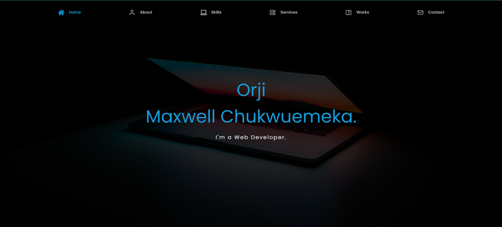

# Portfolio - My Portfolio

**My Portfolio** This a portfolio that shows my previous, current projects that I have built, technologies that I work with and other services I offer.


## Screenshots



<!-- ## Key Features

<br/>
💻 Getting Started

### Prerequisites

In order to run this project you need:
- Visual Studio Code
- Git
- Next
- React
- Javascript


## Installation

To run the Portfolio app locally, follow these steps:

1. Clone the repository:

    ```bash
    git clone https://github.com/Maxwell011/my-new-portfolio.git
    ```

2. Navigate to the project directory:

    ```bash
    cd my-new-portfoli
    ```

3. Install the dependencies:

    ```bash
    npm install
    ```

4. Start the development server:

    ```bash
    npm run dev
    ```

5. Open your web browser and visit http://localhost:3000 to access the my-new-portfoli app.

## Technologies Used

- **Front-end:** HTML, CSS, JavaScript, React.js, Vite, Material UI, Font Awesome Icon, React Scroll 

<!-- -->

## 👥 Authors <a name="authors"></a>

👤 **ORJI MAXWELL**

 - GitHub: [@githubhandle](https://github.com/Maxwell011)
- LinkedIn: [LinkedIn](https://www.linkedin.com/in/chukwuemeka-maxwell/)
- Twitter: [Maxwellchu2Orji](https://Maxwellchu2Orji)

## Contributing

Contributions to the project are welcome! If you'd like to contribute, please follow these steps:

1. Fork the repository.
2. Create a new branch for your feature or bug fix.
3. Make the necessary changes and commit them.
4. Push your changes to your forked repository.
5. Submit a pull request detailing your changes.

<!-- LICENSE -->

## 📝 License <a name="license"></a>

This project is [MIT](./MIT.md) licensed.

## Contact

If you have any questions or suggestions regarding the Realtor project, please contact us at [email protected]

Happy house hunting!
